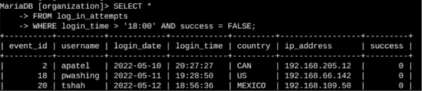
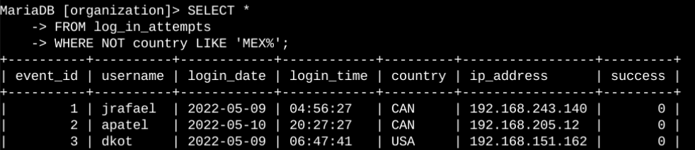
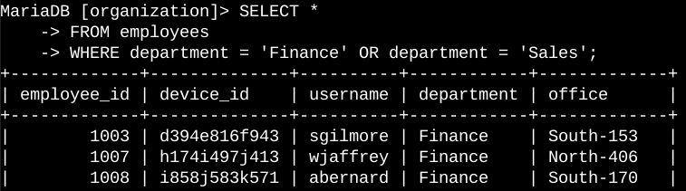
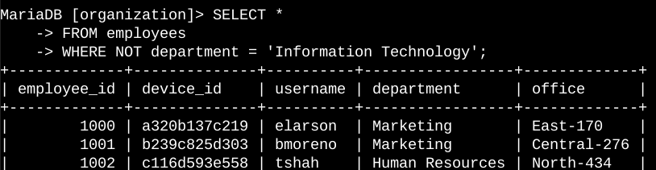

# 🔐 Análisis Forense y Detección de Amenazas con SQL


## 📌 Descripción del proyecto

Este proyecto presenta un análisis forense orientado a la **seguridad de la información**, aplicando consultas SQL para investigar registros de inicio de sesión y datos de empleados dentro de una organización simulada.

El objetivo es demostrar cómo el lenguaje SQL puede utilizarse como herramienta de investigación en ciberseguridad: filtrar evidencia digital, detectar patrones de actividad anómala y apoyar decisiones operativas (como la actualización de equipos por departamento).

El análisis se desarrolla sobre dos tablas principales:

- `log_in_attempts` — registros de intentos de inicio de sesión (fecha, hora, país, éxito/fallo).
- `employees` — información de empleados (departamento, oficina).

---

## 🎯 Objetivos

- Identificar intentos fallidos de inicio de sesión fuera del horario de atención.
- Analizar intentos de inicio de sesión ocurridos en fechas específicas relacionadas con un incidente.
- Detectar intentos de inicio de sesión procedentes de países distintos a México.
- Obtener información de empleados del departamento de Marketing (edificio East) para actualización de equipos.
- Identificar empleados de los departamentos de Finance o Sales para una actualización de seguridad específica.
- Identificar empleados que **no** pertenecen al departamento de TI.
- Aplicar operadores lógicos y de patrones en SQL como parte de un flujo de análisis forense.

---

## 🛠️ Tecnologías y conceptos utilizados

| Tecnología / concepto     | Aplicación                               |
|----------------------------|-------------------------------------------|
| **SQL**                    | Consulta y filtrado de información        |
| **WHERE**                  | Definición de condiciones                 |
| **AND**                    | Combinación de condiciones                |
| **OR**                     | Evaluación de condiciones alternativas    |
| **NOT**                    | Exclusión de determinados registros       |
| **LIKE**                   | Búsqueda mediante patrones                |
| **%**                      | Comodín para coincidencia de caracteres   |
| **Análisis de registros**  | Identificación de actividad sospechosa    |

---

## 🔎 Análisis realizado

### 1. Intentos fallidos de inicio de sesión fuera del horario de atención

**Contexto:** se sospechaba una posible brecha de seguridad ocurrida después del horario comercial. Se analizaron los intentos de inicio de sesión posteriores a las **18:00** que además resultaron fallidos.

```sql
SELECT *
FROM log_in_attempts
WHERE login_time > '18:00'
AND success = FALSE;
```

**Explicación:** se combina `WHERE` con `AND` para cumplir dos condiciones simultáneamente:
- `login_time > '18:00'` → intentos realizados después del horario laboral.
- `success = FALSE` → intentos fallidos.

📷 *Evidencia:* 



---

### 2. Intentos de inicio de sesión en fechas específicas

**Contexto:** se detectó un evento sospechoso el **09/05/2022**. Se analizaron los intentos registrados ese día y el anterior (08/05/2022), para descartar actividad previa relacionada.

```sql
SELECT *
FROM log_in_attempts
WHERE login_date = '2022-05-09'
OR login_date = '2022-05-08';
```

**Explicación:** `OR` permite recuperar registros que cumplan cualquiera de las dos condiciones de fecha.

📷 *Evidencia:* 


---

### 3. Intentos de inicio de sesión fuera de México

**Contexto:** al auditar los accesos, se detectó una anomalía relacionada con conexiones desde el extranjero. Se filtraron los intentos que **no** provienen de México.

```sql
SELECT *
FROM log_in_attempts
WHERE NOT country LIKE 'MEX%';
```

**Explicación:** `NOT` junto con `LIKE 'MEX%'` excluye todos los registros cuyo país comienza con "MEX", dejando visibles únicamente los accesos extranjeros.

📷 *Evidencia:* 



---

### 4. Empleados del departamento de Marketing (edificio East)

**Contexto:** se requería identificar los equipos de Marketing en el edificio East para una actualización de hardware.

```sql
SELECT *
FROM employees
WHERE department = 'Marketing'
AND office LIKE 'East%';
```

**Explicación:** `AND` combina ambos filtros: departamento **y** ubicación de oficina.

📷 *Evidencia:* 



---

### 5. Empleados de Finance o Sales

**Contexto:** estos departamentos requerían una actualización de seguridad distinta a la de Marketing.

```sql
SELECT *
FROM employees
WHERE department = 'Finance'
OR department = 'Sales';
```

**Explicación:** `OR` obtiene empleados que pertenezcan a **cualquiera** de los dos departamentos.

📷 *Evidencia:* 


---

### 6. Empleados que no pertenecen a TI

**Contexto:** identificar a todo el personal fuera del departamento de Tecnología de la Información, como parte de la segmentación de actualizaciones.

```sql
SELECT *
FROM employees
WHERE NOT department = 'Information Technology';
```

**Explicación:** `NOT` excluye los registros cuyo departamento sea TI.

📷 *Evidencia:*



---

## 📊 Resumen

| Tabla analizada     | Propósito principal                          |
|----------------------|-----------------------------------------------|
| `log_in_attempts`    | Detección de accesos fallidos y sospechosos   |
| `employees`          | Segmentación de personal por departamento     |

**Operadores y cláusulas aplicados:** `WHERE`, `AND`, `OR`, `NOT`, `LIKE`, `%`

Este conjunto de consultas permitió analizar escenarios clave de una investigación forense básica: actividad fuera de horario, actividad en fechas críticas, accesos desde el extranjero y segmentación organizacional para gestión de activos.

---

## 🎓 Aprendizajes

Este proyecto reforzó la aplicación de SQL como herramienta de investigación en ciberseguridad, incluyendo:

- Construcción de consultas SQL orientadas a un caso de uso forense.
- Filtrado de registros mediante condiciones simples y combinadas.
- Uso de operadores lógicos (`AND`, `OR`, `NOT`) para acotar evidencia.
- Búsqueda de patrones con `LIKE` y comodines (`%`).
- Interpretación de resultados en el contexto de un incidente de seguridad.
- Aplicación de SQL en flujos de trabajo de un analista SOC / de ciberseguridad.

---

## 📁 Estructura del proyecto

```text
analisis-forense-deteccion-amenazas-sql/
│
├── README.md
│
└── imagenes/
    ├── 01-intentos-fallidos.png
    ├── 02-fechas-especificas.png
    ├── 03-fuera-de-mexico.png
    ├── 04-empleados-marketing.png
    ├── 05-finance-sales.png
    └── 06-no-ti.png
```

---

## 🎓 Nota sobre el proyecto

Proyecto desarrollado con **fines educativos** como parte del curso **Google Cybersecurity Professional Certificate**, realizado a través de **Coursera**. Las capturas corresponden al entorno de laboratorio utilizado durante las prácticas del curso.

---

**Áreas de interés:** Ciberseguridad · Seguridad de la Información · SQL · Análisis Forense · Detección de Amenazas
